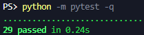

# Gerenciador de Tarefas — Python + SQLite

Sistema de gerenciamento de tarefas em terminal, desenvolvido em Python com banco de dados SQLite.

A aplicação permite controlar tarefas de forma simples, com cadastro, listagem, pesquisa, edição, conclusão, exclusão e exportação de relatório em CSV.

## Visão geral

O projeto foi construído como uma aplicação de terminal organizada, modular e funcional.

Os dados são armazenados localmente em um banco SQLite, permitindo que as tarefas continuem salvas mesmo após o encerramento do programa.

A interface foi pensada para ser direta e fácil de usar, com menus numerados, mensagens padronizadas e validações para evitar entradas inválidas.

Além disso, o projeto possui testes automatizados com `pytest`, cobrindo operações de banco de dados, exportação de relatórios em CSV e funções utilitárias.

## Funcionalidades

* Cadastrar tarefas
* Listar tarefas cadastradas
* Listar tarefas pendentes
* Listar tarefas concluídas
* Pesquisar tarefas pelo título
* Marcar tarefas como concluídas
* Editar título e descrição de tarefas pendentes
* Excluir tarefas
* Exportar relatório em CSV
* Armazenar dados localmente com SQLite
* Tratar entradas inválidas do usuário
* Exibir mensagens padronizadas de sucesso, aviso e erro
* Executar testes automatizados com `pytest`

## Menu principal

| Opção | Função                       |
| ----- | ---------------------------- |
| 1     | Cadastrar tarefa             |
| 2     | Listar tarefas               |
| 3     | Marcar tarefa como concluída |
| 4     | Editar tarefa                |
| 5     | Excluir tarefa               |
| 6     | Pesquisar tarefa por título  |
| 7     | Exportar relatório CSV       |
| 0     | Sair                         |

## Tecnologias utilizadas

* Python 3
* SQLite
* CSV
* Pytest
* Terminal / linha de comando

## Módulos utilizados

O projeto utiliza principalmente módulos da biblioteca padrão do Python:

* `os`
* `sqlite3`
* `csv`
* `datetime`
* `time`

Para os testes automatizados, o projeto utiliza:

* `pytest`

## Estrutura do projeto

| Caminho                | Função                                            |
| ---------------------- | ------------------------------------------------- |
| `main.py`              | Arquivo principal usado para iniciar o sistema    |
| `requirements-dev.txt` | Dependências usadas para desenvolvimento e testes |
| `app/config.py`        | Configurações e constantes do projeto             |
| `app/database.py`      | Funções relacionadas ao banco de dados SQLite     |
| `app/entradas.py`      | Funções de entrada e validação de dados           |
| `app/interface.py`     | Funções visuais da interface em terminal          |
| `app/menus.py`         | Controle dos menus e fluxo principal do sistema   |
| `app/relatorios.py`    | Exportação de relatório em CSV                    |
| `app/tarefas.py`       | Regras e operações relacionadas às tarefas        |
| `app/utils.py`         | Funções utilitárias do sistema                    |
| `tests/`               | Testes automatizados do projeto                   |
| `assets/`              | Imagens usadas na documentação                    |
| `data/`                | Pasta onde o banco SQLite é gerado                |
| `exports/`             | Pasta onde o relatório CSV é gerado               |

## Como executar

1. Tenha o Python 3 instalado na máquina.

2. Clone este repositório ou baixe os arquivos do projeto.

3. Acesse a pasta do projeto pelo terminal.

4. Execute o arquivo principal:

`python main.py`

Ao iniciar, o sistema cria automaticamente o banco de dados `tarefas.db` dentro da pasta `data/`, caso ele ainda não exista.

## Banco de dados

O sistema utiliza SQLite para armazenar as tarefas localmente.

A tabela principal possui os seguintes campos:

| Campo          | Descrição                                  |
| -------------- | ------------------------------------------ |
| `id_tarefa`    | Identificador único da tarefa              |
| `titulo`       | Título da tarefa                           |
| `descricao`    | Descrição da tarefa                        |
| `status`       | Status da tarefa: pendente ou concluída    |
| `data_criacao` | Data e hora em que a tarefa foi cadastrada |

## Exportação CSV

A opção de exportação gera um arquivo chamado:

`relatorio_tarefas.csv`

O arquivo é salvo dentro da pasta:

`exports/`

O relatório contém as seguintes colunas:

| Coluna          | Descrição                       |
| --------------- | ------------------------------- |
| ID              | Identificador da tarefa         |
| Título          | Nome da tarefa                  |
| Descrição       | Detalhes da tarefa              |
| Status          | Situação atual da tarefa        |
| Data de criação | Data em que a tarefa foi criada |

O arquivo é sobrescrito sempre que uma nova exportação é realizada.

## Testes automatizados

O projeto possui testes automatizados com `pytest`.

Os testes cobrem:

* Criação do banco de dados
* Inserção de tarefas
* Busca de tarefas por ID
* Busca de tarefas por status
* Busca de tarefas por título
* Conclusão de tarefas
* Atualização de tarefas
* Exclusão de tarefas
* Exportação de relatório CSV
* Funções utilitárias de formatação

Para instalar as dependências de desenvolvimento, use:

`pip install -r requirements-dev.txt`

Para executar os testes, use:

`python -m pytest -q`

Resultado atual dos testes:

`29 passed`

## Arquivos gerados automaticamente

Durante o uso do sistema, alguns arquivos podem ser criados automaticamente:

| Arquivo                         | Função                           |
| ------------------------------- | -------------------------------- |
| `data/tarefas.db`               | Banco de dados SQLite            |
| `exports/relatorio_tarefas.csv` | Relatório exportado pelo sistema |

Esses arquivos são gerados automaticamente e não precisam ser enviados para o repositório.

## Destaques do projeto

* Código modularizado em arquivos separados
* Interface em terminal com layout organizado
* Persistência de dados com SQLite
* Exportação de relatório em CSV
* Testes automatizados com `pytest`
* Dependências de desenvolvimento separadas em `requirements-dev.txt`
* Uso de type hints
* Tratamento de erros em operações de banco e arquivo
* Separação entre banco de dados, interface, menus, tarefas e relatórios
* Mensagens padronizadas para melhor experiência no terminal

## Autor

Desenvolvido por **Davi Delmondes**.
