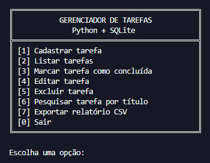

# Gerenciador de Tarefas — Python + SQLite

Sistema de gerenciamento de tarefas em terminal, desenvolvido em Python com banco de dados SQLite.  
A aplicação permite controlar tarefas de forma simples, com cadastro, listagem, pesquisa, edição, conclusão, exclusão e exportação de relatório em CSV.



## Visão geral

O projeto foi construído como uma aplicação de terminal organizada, leve e funcional.  
Os dados são armazenados localmente em um banco SQLite, permitindo que as tarefas continuem salvas mesmo após o encerramento do programa.

A interface foi pensada para ser direta e fácil de usar, com menus numerados, mensagens padronizadas e validações para evitar entradas inválidas.

## Funcionalidades

- Cadastrar tarefas
- Listar tarefas cadastradas
- Listar tarefas pendentes
- Listar tarefas concluídas
- Pesquisar tarefas pelo título
- Marcar tarefas como concluídas
- Editar título e descrição de tarefas pendentes
- Excluir tarefas
- Exportar relatório em CSV
- Armazenar dados localmente com SQLite
- Tratar entradas inválidas do usuário
- Exibir mensagens padronizadas de sucesso, aviso e erro

## Menu principal

```text
[1] Cadastrar tarefa
[2] Listar tarefas
[3] Marcar tarefa como concluída
[4] Editar tarefa
[5] Excluir tarefa
[6] Pesquisar tarefa por título
[7] Exportar relatório CSV
[0] Sair
```

## Tecnologias utilizadas

- Python 3
- SQLite
- CSV
- Terminal / linha de comando

## Módulos utilizados

O projeto utiliza apenas módulos da biblioteca padrão do Python:

- `os`
- `sqlite3`
- `csv`
- `datetime`
- `time`

## Como executar

1. Tenha o Python 3 instalado na máquina.

2. Clone este repositório ou baixe os arquivos do projeto.

3. Acesse a pasta do projeto pelo terminal.

4. Execute o arquivo principal:

```bash
python gerenciador_tarefas_sqlite.py
```

Ao iniciar, o sistema cria automaticamente o banco de dados `tarefas.db`, caso ele ainda não exista.

## Banco de dados

O sistema utiliza SQLite para armazenar as tarefas localmente.

A tabela principal possui os seguintes campos:

| Campo | Descrição |
| --- | --- |
| `id_tarefa` | Identificador único da tarefa |
| `titulo` | Título da tarefa |
| `descricao` | Descrição da tarefa |
| `status` | Status da tarefa: pendente ou concluída |
| `data_criacao` | Data e hora em que a tarefa foi cadastrada |

## Exportação CSV

A opção de exportação gera um arquivo chamado:

```text
relatorio_tarefas.csv
```

O relatório contém as seguintes colunas:

| Coluna | Descrição |
| --- | --- |
| ID | Identificador da tarefa |
| Título | Nome da tarefa |
| Descrição | Detalhes da tarefa |
| Status | Situação atual da tarefa |
| Data de criação | Data em que a tarefa foi criada |

O arquivo é sobrescrito sempre que uma nova exportação é realizada.

## Arquivos gerados automaticamente

Durante o uso do sistema, alguns arquivos podem ser criados automaticamente:

| Arquivo | Função |
| --- | --- |
| `tarefas.db` | Banco de dados SQLite |
| `relatorio_tarefas.csv` | Relatório exportado pelo sistema |

## Destaques do projeto

- Interface em terminal com layout organizado
- Persistência de dados com SQLite
- Exportação de relatório em CSV
- Separação do código em funções
- Uso de type hints
- Tratamento de erros em operações de banco e arquivo
- Mensagens padronizadas para melhor experiência no terminal

## Autor

Desenvolvido por **Davi Delmondes**.
